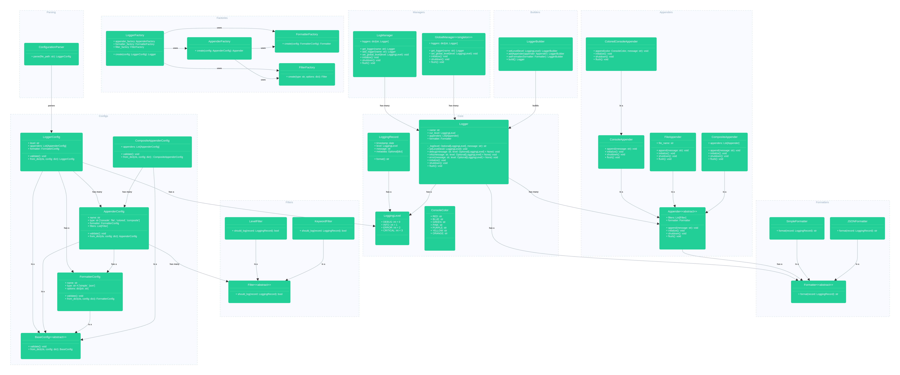

# blink-logger 📝

A pure object-oriented Python logging library I built from scratch because I was bored.

## Features

- 🎯 **Advanced Filtering** - Keyword and level-based filtering
- 🎨 **Colored Output** - Beautiful terminal colors for better readability
- 📄 **Multiple Appenders** - Console, file, and composite output support
- 🔧 **Builder Pattern** - Fluent, chainable logger construction
- 🌍 **Global Management** - Centralized logger registry and management
- 🧩 **Modular Design** - Clean separation of concerns with dependency injection
- 📊 **Multiple Formatters** - Simple text and JSON formatting options

## Architecture



Created using https://gleek.io/

The library follows a modular architecture with clear separation between:
- **Core**: Logger, LogRecord, LoggingLevel, Colors
- **Appenders**: Output destinations (Console, File, Composite)
- **Formatters**: Message formatting (Simple, JSON)
- **Filters**: Message filtering (Keyword, Level-based)
- **Builders**: Fluent logger construction
- **Managers**: Global logger registry and management

## Installation

```bash
# Clone the repository
git clone <repository-url>
cd logging-lib

# Install dependencies
pip install -r requirements.txt

# Run tests to verify installation
python -m pytest tests/ -v
```

## Usage

### Quick Start

```python
from builders.logger_builder import LoggerBuilder
from appenders.console_appender import ColoredConsoleAppender
from formatters.simple_formatter import SimpleFormatter
from core.level import LoggingLevel
from core.color import ConsoleColor

# Create a simple colored logger
logger = (LoggerBuilder()
    .set_name("my-app")
    .set_level(LoggingLevel.INFO)
    .set_formatter(SimpleFormatter())
    .add_appender(ColoredConsoleAppender(color=ConsoleColor.CYAN))
    .build())

logger.log(LoggingLevel.INFO, "Hello, World! 👋")
```

### Advanced Usage

#### File Logging with JSON Format

```python
from builders.logger_builder import LoggerBuilder
from appenders.file_appender import FileAppender
from formatters.json_formatter import JSONFormatter
from core.level import LoggingLevel

logger = (LoggerBuilder()
    .set_name("file-logger")
    .set_level(LoggingLevel.DEBUG)
    .set_formatter(JSONFormatter())
    .add_appender(FileAppender("app.log"))
    .build())

logger.log(LoggingLevel.INFO, "Application started", {"version": "1.0.0"})
```

#### Composite Logging (Multiple Outputs)

```python
from builders.logger_builder import LoggerBuilder
from appenders.console_appender import ColoredConsoleAppender
from appenders.file_appender import FileAppender
from appenders.composite_appender import CompositeAppender
from formatters.simple_formatter import SimpleFormatter
from core.level import LoggingLevel
from core.color import ConsoleColor

# Create multiple appenders
console_appender = ColoredConsoleAppender(
    formatter=SimpleFormatter(),
    color=ConsoleColor.GREEN
)
file_appender = FileAppender(
    file_path="debug.log",
    formatter=SimpleFormatter()
)

# Combine them
composite = CompositeAppender(appenders=[console_appender, file_appender])

logger = (LoggerBuilder()
    .set_name("multi-output")
    .set_level(LoggingLevel.DEBUG)
    .set_formatter(SimpleFormatter())
    .add_appender(composite)
    .build())

logger.log(LoggingLevel.INFO, "This goes to both console and file!")
```

#### Filtering Messages

```python
from builders.logger_builder import LoggerBuilder
from appenders.console_appender import ConsoleAppender
from formatters.simple_formatter import SimpleFormatter
from filters.keyword_filter import KeywordFilter
from filters.level_filter import LevelFilter
from core.level import LoggingLevel

# Create appender with filters
filtered_appender = ConsoleAppender(
    formatter=SimpleFormatter(),
    filters=[
        KeywordFilter(["error", "critical"]),  # Only messages containing these keywords
        LevelFilter(LoggingLevel.WARNING)      # Only WARNING level and above
    ]
)

logger = (LoggerBuilder()
    .set_name("filtered-logger")
    .set_level(LoggingLevel.DEBUG)
    .set_formatter(SimpleFormatter())
    .add_appender(filtered_appender)
    .build())

logger.log(LoggingLevel.INFO, "This will be filtered out")
logger.log(LoggingLevel.ERROR, "This error message will show")
```

#### Global Logger Management

```python
from managers.global_manager import GlobalManager
from builders.logger_builder import LoggerBuilder
from appenders.console_appender import ConsoleAppender
from formatters.simple_formatter import SimpleFormatter
from core.level import LoggingLevel

# Loggers are automatically registered globally when created
logger1 = (LoggerBuilder()
    .set_name("app-logger")
    .set_level(LoggingLevel.INFO)
    .set_formatter(SimpleFormatter())
    .add_appender(ConsoleAppender())
    .build())

# Access global manager
global_mgr = GlobalManager.get_instance()
print(f"Total loggers: {len(global_mgr)}")

# Retrieve logger by name
retrieved_logger = global_mgr.get_logger("app-logger")
retrieved_logger.log(LoggingLevel.INFO, "Retrieved from global manager!")
```

#### Convenience Functions

```python
# Use built-in convenience functions for quick setup
from __init__ import create_simple_logger, create_colored_logger
from core.level import LoggingLevel
from core.color import ConsoleColor

# Simple console logger
simple = create_simple_logger("simple", LoggingLevel.DEBUG)

# Colored console logger  
colored = create_colored_logger("colored", LoggingLevel.INFO, ConsoleColor.MAGENTA)

simple.log(LoggingLevel.INFO, "Simple logging")
colored.log(LoggingLevel.INFO, "Colored logging")
```

### Available Log Levels

```python
from core.level import LoggingLevel

# Available levels (in order of severity)
LoggingLevel.DEBUG     # Detailed diagnostic information
LoggingLevel.INFO      # General information messages
LoggingLevel.WARNING   # Warning messages
LoggingLevel.ERROR     # Error messages
LoggingLevel.CRITICAL  # Critical error messages
```

### Available Colors

```python
from core.color import ConsoleColor

# Available terminal colors
ConsoleColor.RED
ConsoleColor.GREEN  
ConsoleColor.YELLOW
ConsoleColor.BLUE
ConsoleColor.MAGENTA
ConsoleColor.CYAN
ConsoleColor.WHITE
ConsoleColor.DEFAULT
```

## Development

### Running Tests

The library includes a comprehensive test suite with 211+ tests covering all components:

```bash
# Run all tests
python -m pytest tests/ -v

# Run specific test modules
python -m pytest tests/test_appenders.py -v
python -m pytest tests/test_filters.py -v
python -m pytest tests/test_builders.py -v

# Run with coverage
python -m pytest tests/ --cov=. --cov-report=html
```

### Project Structure

```
logging-lib/
├── core/              # Core logging components
│   ├── logger.py      # Main Logger class
│   ├── level.py       # LoggingLevel enum
│   ├── record.py      # LogRecord data structure
│   └── color.py       # Console color definitions
├── appenders/         # Output destinations
│   ├── base_appender.py
│   ├── console_appender.py
│   ├── file_appender.py
│   └── composite_appender.py
├── formatters/        # Message formatting
│   ├── base_formatter.py
│   ├── simple_formatter.py
│   └── json_formatter.py
├── filters/           # Message filtering
│   ├── base_filter.py
│   ├── keyword_filter.py
│   └── level_filter.py
├── builders/          # Fluent construction
│   └── logger_builder.py
├── managers/          # Logger management
│   ├── log_manager.py
│   └── global_manager.py
└── utils/             # Utility decorators
    └── dec.py
```

### Contributing

1. Fork the repository
2. Create a feature branch
3. Make your changes
4. Add tests for new functionality
5. Ensure all tests pass
6. Submit a pull request

## Status

🚧 **Work in Progress** 🚧

This is a hobby project I'm tinkering with. Don't use it in production unless you enjoy living dangerously.

- All 211 tests passing
- No circular import issues  
- Comprehensive feature coverage
- Fun learning experiment with OOP design patterns

## TODO

- An OOP event system
- A simple decorator wrapper
- more to come...

## Credits

- **Development**: Built with curiosity and too much free time (Credit to Google and StackOverflow)
- **Testing**: Comprehensive test suite developed with assistance from **Claude Sonnet 3.5** via GitHub Copilot Chat
- **Architecture**: Inspired by modern logging frameworks with a focus on clean, modular design

## License

This project is open source. See the LICENSE file for details.

---

*Made with ☕, Python, and a healthy dose of over-engineering*
